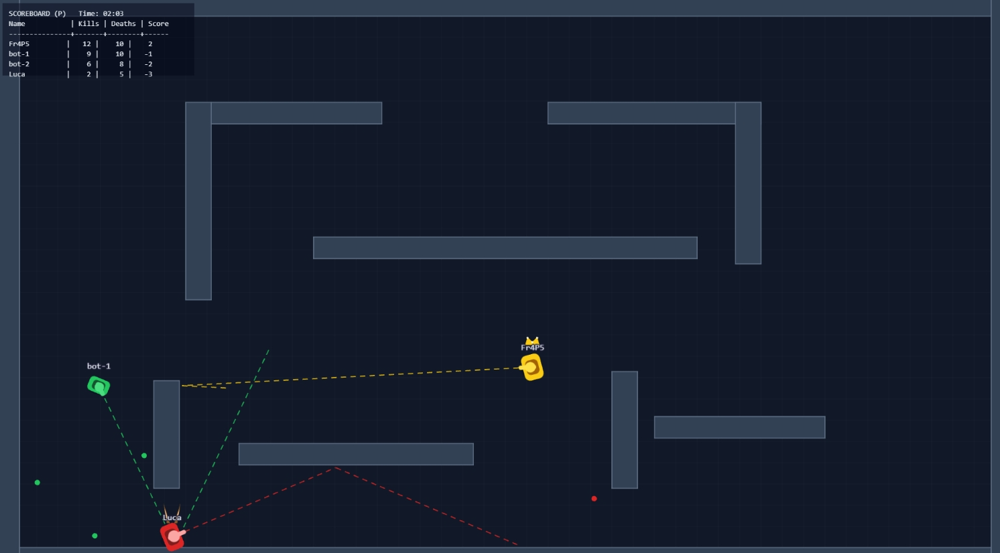

# ShellBounce

A (hopefully competitive) multiplayer tank arena web game built with:

- TypeScript
- Phaser
- Vite
- WebSocket

..and Codex, of course.




## Prerequisites

- Node.js 20+ (LTS recommended)
- npm 10+ (comes with modern Node.js)
- Git

Additional dependencies for self-serving of the game to the outside world:

- A proxy server like NGINX

Check your versions:

```bash
node -v
npm -v
git --version
```

## Install

Clone and enter the project:

```bash
git clone <this-repo-url>
cd shellbounce
```

Install dependencies:

```bash
npm install
```


## Architecture

### Overview

Shellbounce uses a classic client-server architecture:

- **Client (Browser, `src/client`)**: Responsible for rendering the game, capturing user input, and sending player actions to the server. The client does not simulate game logic or physics; it only displays the current state and relays user commands.

- **Server (Node.js, `src/server`)**: Runs the authoritative simulation of the game world using a fixed-timestep loop. It processes all player actions, updates the game state, and resolves all game logic, ensuring fairness and preventing cheating.

- **Shared Code (`src/shared`)**: Contains domain logic, simulation rules, and type definitions used by both client and server to ensure consistency.

### Communication

The client and server communicate via WebSockets. The client sends user input (such as movement or firing commands) to the server. The server processes these inputs, updates the game state, and periodically streams authoritative state snapshots back to all connected clients. This ensures all players see a consistent and up-to-date view of the game world.

The browser never drives core mechanics; the server is always the source of truth.


## Quickstart (Development)

1. Start the authoritative server:

```bash
npm run dev:server
```

2. In a second terminal, start the browser client:

```bash
npm run dev:client
```

3. Open the client URL printed by Vite (usually `http://localhost:5173`).


## Useful Scripts

- `npm run dev`: Alias for "vite" command (analogous to npm run dev:client)
- `npm run build`: Type-check client and build production assets
- `npm run build:server`: Type-check server and build production assets
- `npm run preview`: Preview production client build locally
- `npm run typecheck:server`: Type-check server and shared packages
- `npm run dev:client`: Start Vite development server for client serving
- `npm run dev:server`: Start authoritative server in watch mode (to reload live changes)
- `npm run prod:client`: Start Vite production server for client serving (static assets in dist/)
- `npm run prod:server`: Start authoritative server from production assets with Node


## Project Structure and Files Explanation

**Note: Section subjected to continuous changes.**

```text
shellbounce/
├── docs/
│   └── images/
├── src/
│   ├── client/
│   │   ├── audio/
│   │   │   └── SfxController.ts
│   │   ├── icons/
│   │   ├── network/
│   │   │   ├── GameClient.ts
│   │   │   ├── GameCommands.ts
│   │   │   ├── InputController.ts
│   │   │   └── utils.ts
│   │   ├── render/
│   │   │   ├── BoostEffect.ts
│   │   │   ├── DynamicElements.ts
│   │   │   ├── Effects.ts
│   │   │   ├── ExplosionEffect.ts
│   │   │   ├── RenderBullet.ts
│   │   │   ├── RenderMine.ts
│   │   │   ├── RenderShotPreview.ts
│   │   │   ├── RenderTank.ts
│   │   │   ├── ScoreBoard.ts
│   │   │   ├── TankDestructionEffect.ts
│   │   │   └── tankVisuals.ts
│   │   ├── scenes/
│   │   │   └── NetworkGameScene.ts
│   │   ├── ui/
│   │   │   └── showJoinOverlay.ts
│   │   ├── utils/
│   │   │   └── utils.ts
│   │   └── main.ts
│   ├── server/
│   │   └── index.ts
│   ├── shared/
│   │   ├── config.ts
│   │   ├── constants.ts
│   │   ├── map.ts
│   │   ├── math.ts
│   │   ├── shotPrediction.ts
│   │   ├── simulation.ts
│   │   └── types.ts
│   └── main.ts
├── index.html
├── LICENSE
├── package-lock.json
├── package.json
├── README.md
├── tsconfig.json
├── tsconfig.server.json
└── vite.config.ts
```

- *index.html*: Entry HTML file for the client application. This is the main HTML page loaded by the browser. It tells the browser to run and execute the client logic in 'app' container treating it an ES  module (after Vite transpiling from Typescript to Javascript)
- *package.json*: Project manifest. Defines dependencies, scripts, and project metadata for npm.
- *tsconfig.json*: TypeScript configuration for the client and shared code. Specifies compiler options and file inclusions (read when running commands like "npm run build" and "npm run dev:client")
- *tsconfig.server.json*: TypeScript configuration for the server code. Allows for separate server-specific compiler options (read when running commands like "npm run build:server" and "npm run dev:server")
- *vite.config.ts*: Vite configuration file. Sets up the build and development server for the client application.


## Game Deployment

**Note: Section subjected to continuous changes.**

If you wanna try this game with your friends, you'll have to expose it to the external world.

Here are some tips:

- VM has been put under macvtap networking mode (requires ethernet cable connection)
- Check VM Firewall inbound rules allow incoming connections on port 3000
- Port forwarding of port 3000 of VM (via router port forwarding settings)
- NGINX used as proxy server to :
  - redirect client external requests (port 3000) to:
    - Vite
    - WebSocket Server
    ```
        server {
            listen 3000;
            server_name _;

            location / {
                proxy_pass http://127.0.0.1:5173;
                proxy_http_version 1.1;
                proxy_set_header Host $host;
                proxy_set_header X-Real-IP $remote_addr;
                proxy_set_header X-Forwarded-For $proxy_add_x_forwarded_for;
                proxy_set_header X-Forwarded-Proto $scheme;
            }

            location /api/ {
                proxy_pass http://127.0.0.1:8080/api/;
                proxy_http_version 1.1;
                proxy_set_header Host $host;
                proxy_set_header X-Real-IP $remote_addr;
                proxy_set_header X-Forwarded-For $proxy_add_x_forwarded_for;
                proxy_set_header X-Forwarded-Proto $scheme;
            }

            location /ws {
                proxy_pass http://127.0.0.1:8080/ws;
                proxy_http_version 1.1;
                proxy_set_header Upgrade $http_upgrade;
                proxy_set_header Connection "upgrade";
                proxy_set_header Host $host;
            }
        }
    ```
- Start your NGINX proxy server with `start nginx` ran from shell with admin. privileges, from NGINX folder.
- Get your public IP at https://whatismyipaddress.com/
- Access the game at http://<my_public_IP>:3000
